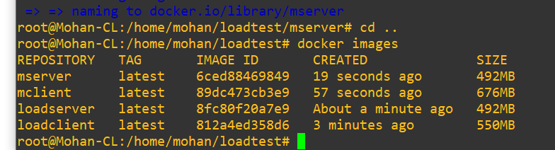
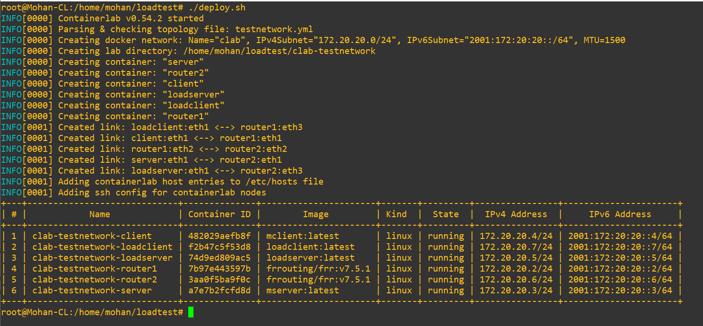
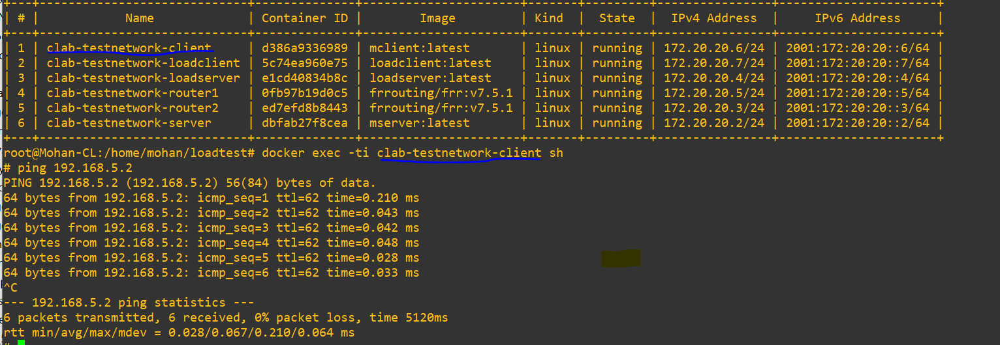

# Containerlab network component for testing your client and server application
## Prerequisite
To deploy the network components based on Containerlab, we first need to install Docker and Containlab. Refer to the installation guide on the Edge onboarding Wiki (https://git.inf.fh-dortmund.de/01/smart-edge-lab/edge-onboarding/-/wikis/CONTAINERlab)  or the official Containerlab guide: https://containerlab.dev/install/

## Topology


This basic network setup uses two routers (FRR-routers), two clients (one to generate additional load) and two servers (one to receive the additional load). Since all devices are containerized, we need appropriate images to create the containers. For the FRR routers, we utilize official images, but we have to prepare customized images for our clients and servers.

## Prepare load client and server images
The purpose of the load client is to generate a specified load over a given period on the network. In this setup, there is no need to alter any configurations on the load client and load servers. Simply build the images and incorporate them into the topology file. How do you build the images? You can find the instructions later. 

##  Build your client and server images
Within the "mclient" folder, you'll find a Dockerfile containing a sample configuration to build the client image. However, you'll need to customize it to align with your specific requirements. For instance, you may need to alter the client application, include additional Python libraries in the requirements file, etc. However, please make sure to use the same server URL (server_url = 'http://192.168.5.2:8080') in your client application,  because your server container gets this IP address from the network. Important: If you want to use a different port number, adjust it in the Dockerfile (EXPOSE xxxx) and the server application.
In short, just update or replace the cli.py code with your client application and then build the image accordingly.
To prepare your server image, you'll need to modify the Dockerfile in the "mserver" folder. The process is the same as preparing your client image.

## Deploying your topology and start testing your application
(Assuming your working folder is {containerlab-integration branch}  "emulate-edge-diagnostics-platform\src\main\ContainerLab")

To build the images, run the following script
```sh
#remember to gice execution permissions
chmod u+x build_images.sh
./buildimages.sh
```
Once you build your images, you can see them using the "docker images" command
```sh
docker images
```




## Preparing the network topology
Containerlab uses a YAML file specifying your network's networking and user devices, their configurations, and how they are connected. When you deploy the topology, Containelab creates Docker containers for each node. Let's look at our topology, defined in the  testnetwork.yml file.

```
name: testnetwork
topology:
  nodes:
    router1:
      kind: linux
      image: frrouting/frr:v7.5.1
      binds:
        - router1/daemons:/etc/frr/daemons
        - router1/frr.conf:/etc/frr/frr.conf
    router2:
      kind: linux
      image: frrouting/frr:v7.5.1
      binds:
        - router2/daemons:/etc/frr/daemons
        - router2/frr.conf:/etc/frr/frr.conf
    ### Your client image goes here
    client:
       kind: linux
       image: mclient:latest  ### Image that we built at the beginning

    ### Your server image goes here
    server:
       kind: linux
       image: mserver:latest 
    
    ### Client to generate load
    loadclient1:
       kind: linux
       image: mohanloadclient:latest

    loadserver:
       kind: linux
       image: mohanloadserver:latest 

  ## Defining how devices are connected 
  links:
    - endpoints: ["client:eth1", "router1:eth1"]   ## Your client is connected to the router1 Ethernet port 1
    - endpoints: ["loadclient1:eth1", "router1:eth3"]  ## Loadclient is connected to the router1 Ethernet port 3
    - endpoints: ["router1:eth2", "router2:eth2"]  ## Connection between router 1 and 2
    - endpoints: ["server:eth1", "router2:eth1"]  ## Your server is connected to the router2 Ethernet port 1
    - endpoints: ["loadserver:eth1", "router2:eth3"] ## Loadserver is connected to the router2 Ethernet port 3  
```
We have two routers and use official images to create router container nodes. Each router has a configuration file that will be used as a startup configuration for the router. You can see it inside router1 and router2 folders, but usually, you don't need to change it.
Then, you can see the configurations of user devices (clients and servers). We use our custom-built images to create the user device containers. It is very important that if you change anything in your client or server app, remember to rebuild the image (run  ./buildimages.sh) unless the topology still uses the old image to create the container.
At the bottom of the .yml, you can see the endpoints defining how each device is connected. For example, your client is connected to the router1 eth1 interface. You also see this connection with the associated IP addresses on the topology diagram.
## Interface configurations
We have to configure IP addresses on user devices (our client and servers) in order to communicate with each other. According to the router configurations, "interfaces.sh" file defines the IP address configuration for each device. Usually, you don't need to change this configuration, and the script allocates the address during the startup.
## Deploy the topology 
Run the following script
```sh
#remember to gice execution permissions
 chmod u+x deploy.sh
 sudo ./deploy.sh 
```
You can see the deployed containers with their details




View the topology
```sh
 ./viewTopology.sh
```
You can visualize the topology at http:// "your IP address":50080


You can access the shell of any running container node with the following command
```sh
 docker exec -ti your-container-name sh
 ```
For example, to access your client and test the connectivity with the server
```sh
docker exec -ti clab-testnetwork-client sh
#ping 192.168.5.2
```



Since you have access to the running container's shell, you can also start your client application and collect the traces accordingly. You have a network with default settings and no additional traffic on the links. However, you may want to see how your application behaves under different network conditions.

## Change the data rate on the network link
In our topology, router1 and router2 are connected via an Ethernet link, and we have the capability to adjust the data rate on this link in real-time. Using the 'manageInterface.sh' script, you can modify the data rate for a specified duration. For instance, to set the data rate to 150mbps for 50 seconds, execute the script in a new terminal:
```sh
./manageInterface.sh 150 50
```
Here, the first argument represents the desired data rate in mbps, while the second argument indicates the duration in seconds. Once the specified time elapses, the interface data rate reverts to its default setting.

### Example

To simply visualize how the interface data rate affects the communication, we will perform an small example.

First, change the interface to a very low value.
```sh
./manageInterface.sh 1 25
```

Then, access the client container and send a ping request

```sh
docker exec -ti clab-testnetwork-client sh
#ping 192.168.5.2
```

You will notice that as long as the event is executed, the time of the ping will be increased, when the interface returns to normal, it decreases. 


## Induce additional load
Apply additional load by executing the ./manageLoad.sh script with two arguments: file size and duration. For instance, to simulate a 1MB load for 75 seconds, run: 
```sh
./manageLoad.sh 1 75
```
Please note that currently, you have only 1MB, 2MB, 5MB, 10MB, 15MB, 20MB, 30MB, 40MB and 50MB for the additional loads. That means your first argument must only be one of the above file sizes.


## Destroy the topology
After your experiments, you have to destroy the topology
```sh
sudo ./destroy.sh
```